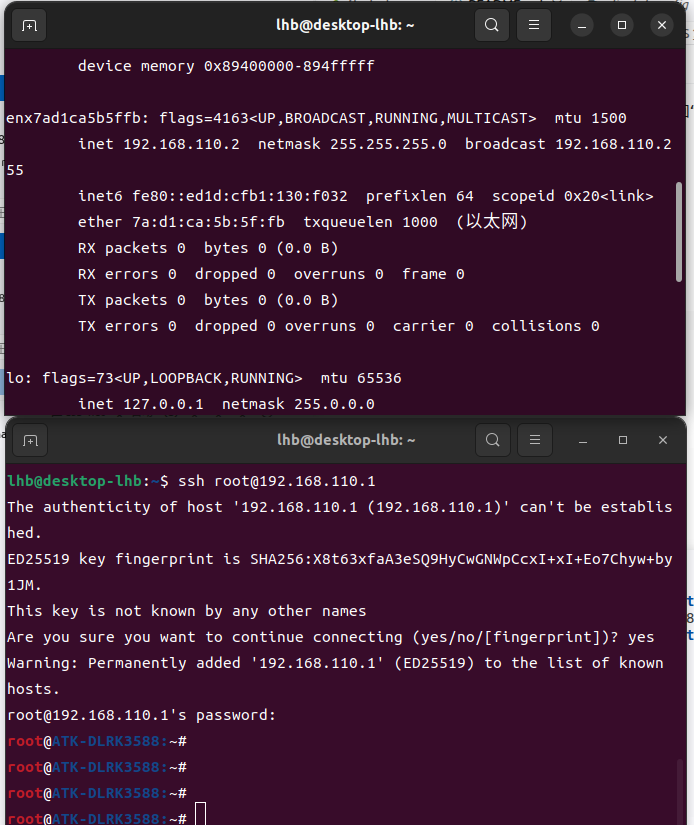

# 正点原子 RK3588 SDK 配置 USB0 为 ADB + USB 网卡复合设备

本文记录如何在正点原子 RK3588 SDK 中，将 USB0 配置为一个 USB composite gadget，使同一个 USB 口同时具备 ADB 调试和 RNDIS USB 网卡能力。完成后，开发板通过 USB 连接电脑时，电脑既可以继续使用 ADB，也可以通过固定 IP 访问开发板。

usb_net/rk3588_sdk目录按 SDK 原始路径保存了本次修改涉及的文件，方便后续对比、恢复或移植。

## 目标效果

最终 USB0 的功能如下：

```text
ADB + RNDIS USB 网卡
```

网络参数如下：

```text
开发板 usb0 固定 IP: 192.168.110.1/24
DHCP 地址池:          192.168.110.2 - 192.168.110.20
电脑端 IPv4:          自动获取
```

连接电脑后，可以使用：

```sh
adb devices
ping 192.168.110.1
ssh root@192.168.110.1
```

## 方案说明

本文采用单 USB0 复合设备方案：只使用 USB0 对应的 `fc000000.usb`，由 SDK 原有的 `usbdevice` 脚本创建一个 composite gadget，并在同一个 gadget 中同时启用 `adb` 和 `rndis` function。

板端可通过下面命令查看当前可用 UDC：

```text
ls /sys/class/udc
```

当前配置会优先选择：

```text
fc000000.usb
```

需要注意：

- `usb0` 是 Linux 中 RNDIS 网卡接口名，不等于 USB0 物理控制器名。
- `fc000000.usb` 是当前方案优先绑定的 UDC。
- ADB 和 RNDIS 是同一个 USB 设备下的两个 function。
- Windows 端显示“未识别的网络”通常不影响使用，因为这是点对点调试网卡，没有公网网关。

## 文件清单

本次修改涉及以下 SDK 文件：

```text
rk3588_sdk/device/rockchip/.chips/rk3588/alientek_rk3588_defconfig
rk3588_sdk/device/rockchip/.chips/rk3588/usb-rndis-ip.sh
rk3588_sdk/external/rkscript/usbdevice
rk3588_sdk/kernel/arch/arm64/configs/rockchip_linux_defconfig
rk3588_sdk/kernel/arch/arm64/boot/dts/rockchip/rk3588-atk-devkit.dtsi
rk3588_sdk/buildroot/configs/rockchip/alientek.config
rk3588_sdk/buildroot/board/rockchip/alientek/busybox.fragment
```

这些文件在当前备份目录中也各保存了一份：

```text
usb_net/rk3588_sdk/device/rockchip/.chips/rk3588/alientek_rk3588_defconfig
usb_net/rk3588_sdk/device/rockchip/.chips/rk3588/usb-rndis-ip.sh
usb_net/rk3588_sdk/external/rkscript/usbdevice
usb_net/rk3588_sdk/kernel/arch/arm64/configs/rockchip_linux_defconfig
usb_net/rk3588_sdk/kernel/arch/arm64/boot/dts/rockchip/rk3588-atk-devkit.dtsi
usb_net/rk3588_sdk/buildroot/configs/rockchip/alientek.config
usb_net/rk3588_sdk/buildroot/board/rockchip/alientek/busybox.fragment
```

## 修改一：启用 SDK USB gadget 功能

文件：

```text
rk3588_sdk/device/rockchip/.chips/rk3588/alientek_rk3588_defconfig
```

关键配置：

```text
RK_USB_ENABLED=y
RK_USB_ADBD=y
RK_USB_RNDIS=y
RK_USB_HOOKS="usb-rndis-ip.sh"
```

含义：

- `RK_USB_ENABLED=y`：启用 SDK 的 USB gadget 服务。
- `RK_USB_ADBD=y`：启用 ADB function。
- `RK_USB_RNDIS=y`：启用 RNDIS USB 网卡 function。
- `RK_USB_HOOKS="usb-rndis-ip.sh"`：安装并加载自定义 hook，用于配置 `usb0` IP 和启动 DHCP 服务。

这一步决定了 rootfs 中会安装并启动 Rockchip SDK 的 `usbdevice` 服务，同时让它创建 `adb + rndis` 复合设备。

## 修改二：让 usbdevice 绑定到 USB0 UDC

文件：

```text
rk3588_sdk/external/rkscript/usbdevice
```

关键修改：

```sh
source "/etc/usbdevice.d/$hook"
USB_UDC=${USB_UDC:-$(ls /sys/class/udc/ | grep -m 1 fc000000 || true)}
USB_UDC=${USB_UDC:-$(ls /sys/class/udc/ | head -n 1)}
```

第一处修改修正 hook 加载路径，让 `usb-rndis-ip.sh` 能从 `/etc/usbdevice.d/` 被正确加载。

第二处修改让 gadget 优先绑定到 `fc000000.usb`。如果系统中找不到该 UDC，再回退到 `/sys/class/udc/` 中的第一个 UDC。

启动后，日志中应能看到类似信息：

```text
Using USB UDC device: fc000000.usb
Starting functions: rndis adb
```

## 修改三：配置 RNDIS IP 和 DHCP 服务

文件：

```text
rk3588_sdk/device/rockchip/.chips/rk3588/usb-rndis-ip.sh
```

当前脚本内容：

```sh
RNDIS_IP=${RNDIS_IP:-192.168.110.1}
RNDIS_NETMASK=${RNDIS_NETMASK:-255.255.255.0}
RNDIS_DHCP_START=${RNDIS_DHCP_START:-192.168.110.2}
RNDIS_DHCP_END=${RNDIS_DHCP_END:-192.168.110.20}
RNDIS_DHCP_LEASE_TIME=${RNDIS_DHCP_LEASE_TIME:-86400}
RNDIS_DHCP_CONF=${RNDIS_DHCP_CONF:-/tmp/udhcpd-usb0.conf}
RNDIS_DHCP_PID=${RNDIS_DHCP_PID:-/tmp/udhcpd-usb0.pid}
RNDIS_DHCP_LEASES=${RNDIS_DHCP_LEASES:-/tmp/udhcpd-usb0.leases}

rndis_dhcp_stop()
{
	if [ -f "$RNDIS_DHCP_PID" ]; then
		kill "$(cat "$RNDIS_DHCP_PID")" 2>/dev/null || true
		rm -f "$RNDIS_DHCP_PID"
	fi

	killall udhcpd 2>/dev/null || true
}

rndis_dhcp_start()
{
	if ! command -v udhcpd >/dev/null 2>&1; then
		echo "udhcpd not found, skip USB RNDIS DHCP server"
		return 0
	fi

	rndis_dhcp_stop
	touch "$RNDIS_DHCP_LEASES"

	{
		echo "start $RNDIS_DHCP_START"
		echo "end $RNDIS_DHCP_END"
		echo "interface usb0"
		echo "option subnet $RNDIS_NETMASK"
		echo "option router $RNDIS_IP"
		echo "option lease $RNDIS_DHCP_LEASE_TIME"
		echo "lease_file $RNDIS_DHCP_LEASES"
		echo "pidfile $RNDIS_DHCP_PID"
	} > "$RNDIS_DHCP_CONF"

	udhcpd "$RNDIS_DHCP_CONF"
}

rndis_start()
{
	ifconfig usb0 "$RNDIS_IP" netmask "$RNDIS_NETMASK" up
	rndis_dhcp_start
}

rndis_stop()
{
	rndis_dhcp_stop
	ifconfig usb0 down 2>/dev/null || true
}
```

这个 hook 会在 RNDIS function 启动后执行 `rndis_start()`：

1. 将开发板端 `usb0` 配置为 `192.168.110.1/24`。
2. 生成 `/tmp/udhcpd-usb0.conf`。
3. 启动 `udhcpd`，给电脑端 USB 网卡分配 `192.168.110.2 - 192.168.110.20` 中的地址。

这样 Windows 端不需要手动填写 IPv4，只需设置为自动获取。

## 修改四：确保 Buildroot 编译 udhcpd

只写 `usb-rndis-ip.sh` 还不够，rootfs 中必须存在 `udhcpd` 命令。因此需要打开 BusyBox 的 DHCP server applet。

文件：

```text
rk3588_sdk/buildroot/configs/rockchip/alientek.config
```

关键配置：

```text
BR2_PACKAGE_BUSYBOX_CONFIG_FRAGMENT_FILES+=" board/rockchip/alientek/busybox.fragment"
```

文件：

```text
rk3588_sdk/buildroot/board/rockchip/alientek/busybox.fragment
```

内容：

```text
CONFIG_UDHCPD=y
CONFIG_FEATURE_UDHCPD_WRITE_LEASES_EARLY=y
CONFIG_DHCPD_LEASES_FILE="/tmp/udhcpd.leases"
```

这样重新编译 rootfs 后，BusyBox 会包含 `udhcpd`，开发板启动 RNDIS 时才能自动给电脑发 IP。

## 修改五：内核启用 USB 网卡 function

文件：

```text
rk3588_sdk/kernel/arch/arm64/configs/rockchip_linux_defconfig
```

关键配置：

```text
CONFIG_USB_CONFIGFS_NCM=y
CONFIG_USB_CONFIGFS_ECM=y
CONFIG_USB_CONFIGFS_RNDIS=y
```

当前实际使用的是 RNDIS。保留 NCM 和 ECM 是为了后续需要兼容 Linux/macOS 或其他 USB 网卡模式时有扩展空间。

## 修改六：设备树保持 USB0 gadget 可用

文件：

```text
rk3588_sdk/kernel/arch/arm64/boot/dts/rockchip/rk3588-atk-devkit.dtsi
```

USB0 DWC3 节点需要保持可用：

```dts
&usbdrd_dwc3_0 {
	dr_mode = "otg";
	status = "okay";
	usb-role-switch;
};
```

本方案只需要保证 USB0 对应的 DWC3 gadget 控制器可用，后续 ADB 和 RNDIS function 都由 `usbdevice` 在同一个 composite gadget 中创建。

## 编译和打包

如果只修改了 rootfs 脚本、Buildroot 配置或 USB hook：

```sh
cd /home/lhb/linux/rk3588_driver/rk3588_sdk
./build.sh buildroot
./build.sh firmware
./build.sh updateimg
```

如果同时修改了内核 defconfig 或 DTS：

```sh
cd /home/lhb/linux/rk3588_driver/rk3588_sdk
./build.sh kernel
./build.sh buildroot
./build.sh firmware
./build.sh updateimg
```

其中：

- `buildroot`：重新生成 rootfs，包含 `usbdevice`、hook、`udhcpd` 等 rootfs 内容。
- `kernel`：重新编译内核和设备树。
- `firmware`：刷新 `rockdev/` 下的分区镜像链接和固件目录。
- `updateimg`：重新生成整包 `update.img`。

如果只运行 `./build.sh firmware`，通常不会重新编译 rootfs，也不会生成新的 `update.img`，这也是修改脚本后看起来没有生效的常见原因。

## 板端验证

烧录后进入开发板，查看 USB gadget 状态：

```sh
cat /var/log/usbdevice.log | grep -E "Using USB UDC|Starting functions"
cat /sys/kernel/config/usb_gadget/rockchip/UDC
ls /sys/kernel/config/usb_gadget/rockchip/functions
ifconfig usb0
```

期望结果包含：

```text
Using USB UDC device: fc000000.usb
Starting functions: rndis adb
fc000000.usb
ffs.adb
rndis.gs0
192.168.110.1
```

确认 DHCP 服务：

```sh
which udhcpd
ps | grep udhcpd
cat /tmp/udhcpd-usb0.conf
```

期望 `/tmp/udhcpd-usb0.conf` 中能看到：

```text
start 192.168.110.2
end 192.168.110.20
interface usb0
option subnet 255.255.255.0
option router 192.168.110.1
```

## 电脑端验证

Windows 端将该 USB 网卡设置为：

```text
IPv4: 自动获得 IP 地址
DNS:  自动获得 DNS 服务器地址
```

如果之前手动设置过 IPv4，建议改回自动获取后，禁用再启用一次该 USB 网卡，或者重新插拔 USB。

验证命令：

```sh
adb devices
ping 192.168.110.1
ssh root@192.168.110.1
```

Linux 主机上可以查看 USB 网卡是否拿到地址：

```sh
ip addr
ip route
ping 192.168.110.1
```

## 下载验证

Linux 主机侧 USB 网卡已经通过 DHCP 自动获取到地址：

```text
enx7ad1ca5b5ffb
inet 192.168.110.2
netmask 255.255.255.0
```

随后通过 USB 网卡 SSH 登录开发板：

```sh
ssh root@192.168.110.1
```

登录成功后，终端提示符为：

```text
root@ATK-DLRK3588:~#
```

验证截图：



ADB 和 RNDIS 复合设备同时启用，板端固定 IP 为 `192.168.110.1`，主机端可通过 DHCP 自动获取 `192.168.110.x` 地址。
